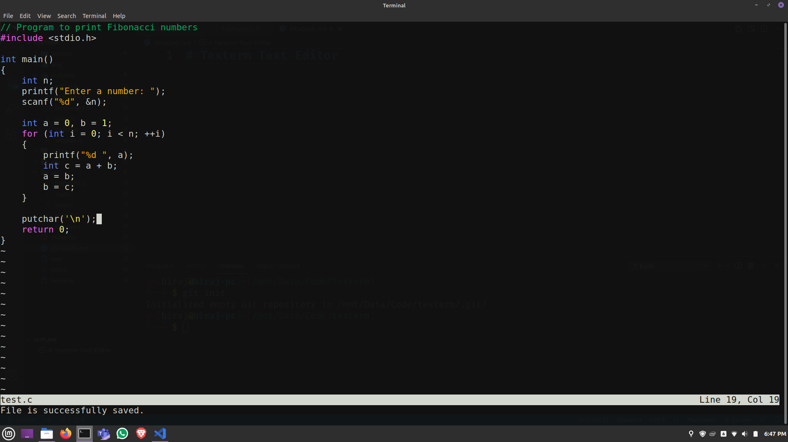

# Texterm Text Editor
A very minimal & simple text editor written in C with only Standard C Library.

 

As of now, it only supports syntax highlighting for C & JavaScript. It also lacks common features like undo/redo, text replace, etc.

<b>Learn to build your own text editor:</b> https://viewsourcecode.org/snaptoken/kilo/

 

## Build
``make texterm``

 

## Usage
``texterm <file>``

 

# For those who want to read the code
## Naming conventions used:
* <b>variable names</b> - snake_case
* <b>function names</b> - snake_case
* <b>structs & enums</b> - CamelCase

 

## Project's Structure
<b>include directory</b> - contains header files
* <b>editor.h</b> - declaration of type ``Editor``
* <b>highlight.h</b> - declaration of ``SyntaxInfo`` type & prototypes for functions in <i>highlight.c</i>
* <b>languages.h</b> - contains languages' extensions, keywords & stuff
* <b>strbuf.h</b> - declaration of ``StringBuffer`` type & prototypes for functions in <i>strbuf.c</i>
* <b>rows.h</b> - declaration of ``EditorRow`` type & prototypes for functions in <i>rows.c</i>
* <b>winsize.h</b> - function prototype for ``get_win_size`` in <i>winsize.c</i>

<b>src directory</b> - contains source files (.c)
* <b>main.c</b> - main function, opening file, saving file, rendering ui, etc.
* <b>highlight.c</b> - syntax higlighting stuff (where ``EditorRow's hl field`` is processed)
* <b>strbuf.c</b> - functions for appending & freeing ``StringBuffer``
* <b>rows.c</b> - row functions (insert/delete char, insert string, etc.)
* <b>winsize.c</b> - for getting window's size