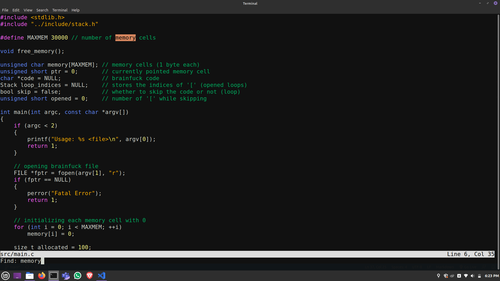

# Texterm Text Editor

A simple, minimal & performant text editor written in C with only C's Standard Library.



_**Note**: This project is undergoing refactoring at the moment._

## Syntax highlighting supported for

- C/C++
- JavaScript
- Python
- SQL

## Installation

- Make sure that `gcc` & `make` are installed.
- Make _install.sh_ file executable.
  ```
  chmod +x install.sh
  ```
- Execute the installation script.
  ```
  ./install.sh
  ```

## Build

`make texterm`

## Usage

`texterm [FILE]`

## Acknowledgement

This project is based on [Snaptoken's](https://github.com/snaptoken) _Build Your Own Text Editor_ [tutorial](https://viewsourcecode.org/snaptoken/kilo/). Thanks [Paige Ruten](https://github.com/paigeruten)!

## Planned Features

- Undo & redo
- Text replace
- Colored bracket pair
- Syntax highlightng for other languages

## Contributing

Read [contributing guidlines](./CONTRIBUTING.md).
